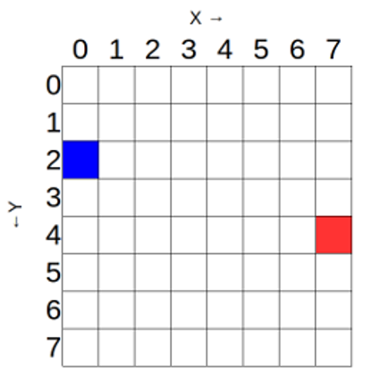

The Sense HAT's LED matrix uses a coordinate system with an x- and a y-axis. The numbering of both axes begins at `0` (not 1) in the top left-hand corner. Each LED can be used as one pixel of an image, and it can be addressed using an `x, y` notation.

The blue pixel is at coordinates `0, 2`.
The red pixel is at coordinates `7, 4`.

You can set pixels (LEDs) individually using the `set_pixel()` method.

To replicate the diagram above, you would enter a program like this:

<iframe src="https://trinket.io/embed/python/c57565feac" width="100%" height="600" frameborder="0" marginwidth="0" marginheight="0" allowfullscreen></iframe>
