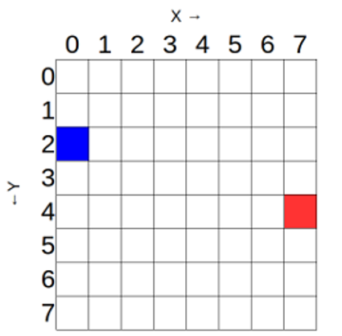

De LED-matrix van de Sense HAT maakt gebruik van een coördinatensysteem met een x- en een y-as. De nummering van beide assen begint bij `0` (niet 1) in de linkerbovenhoek. Elke LED kan als één pixel van een afbeelding worden gebruikt en kan worden geadresseerd met een `x, y` notatie.

De blauwe pixel bevindt zich op coördinaat `0, 2`. De rode pixel bevindt zich op coördinaat `7, 4`.

Je kunt pixels (LED's) afzonderlijk instellen met de methode `set_pixel ()`.

Om het bovenstaande diagram te reproduceren, voer je een programma als dit in: <iframe src="https://trinket.io/embed/python/c57565feac" width="100%" height="600" frameborder="0" marginwidth="0" marginheight="0" allowfullscreen></iframe>
